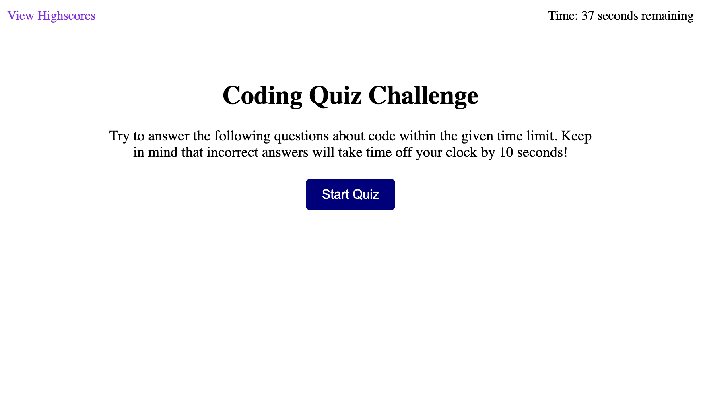

# Code Quiz Challenge
Create a website where the user can take a short quiz on code-related questions.

## What it must contain/Description
* Must have a working timer with seconds remaining
* Buttons and links works properly
* Displays "wrong" or "correct" after selecting an answer

## Assets
The following shows what the website should look like:
